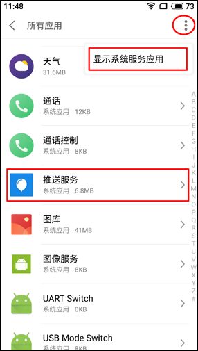
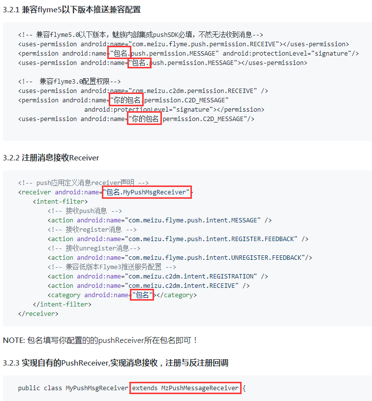
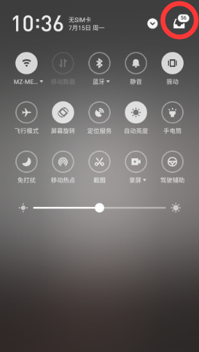
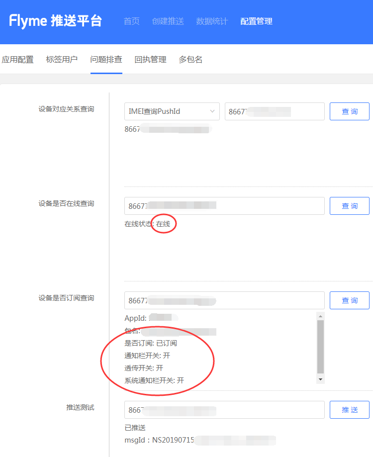

# 魅族推送 PushSDK3 说明文档

## 目录<a name="index"/>
* [1 获取](#download)
* [2 更新日志](#update_logs)
* [3 接入步骤](#access_steps)
    * [3.1 配置依赖](#config_dependencies)
    * [3.2 声明权限](#declare_permissions)
    * [3.3 注册消息接收的广播](#register_broadcast)
    * [3.4 实现消息接收的广播](#realize_broadcast)
* [4 功能说明](#functional_description) 
    * [4.1 PushManager接口说明](#push_manager_description)
    * [4.2 MzPushReceiver回调方法说明](#mz_push_receiver_description)
* [5 通知栏消息推送原理](#notification_description)
    * [5.1 通知的生成](#notification_create)
    * [5.2 通知的点击](#notification_click)
        * [5.2.1 打开应用主页 和 打开应用内页面](#open_page)
        * [5.2.2 打开URI](#open_uri)
        * [5.2.3 客户端自定义](#self_definition_contentString)
* [6 历史变更和兼容](#adaptation_flyme)
    * [6.1 订阅和取消订阅接口变更](#adaptation_register)
    * [6.2 设置通知的状态栏小图标](#adaptation_small_icon)
    * [6.3 透传功能回调](#adaptation_transparent_callback)
    * [6.4 透传功能停用](#transparent_stop_using)
    * [6.5 声明权限](#adaptation_declare_permissions)
    * [6.6 MzPushMessageReceiver action 声明](#adaptation_receiver_action)
    * [6.7 通知栏消息点击回调方法](#adaptation_notification_clicked_callback)
    * [6.8 通知栏消息展示回调方法](#adaptation_notification_arrived_callback)
* [7 常见问题](#faq)
* [8 反馈与建议](#feed_back)    

## 1 获取<a name="download"/>
[官网下载AAR][official-releases]

## 2 更新日志<a name="update_logs"/>
### [2021-06-18]V4.1.0
* 解决 R8 兼容问题
* 修复某情况下通知栏消息不振动的 BUG
* 移除不必要的异常打印

### [2021-01-04]V4.0.4
* 适配新设备

### [2020-11-13]V4.0.2
* 全面适配Android11
* 修复一些安全漏洞和若干BUG
* 优化一些性能问题

### [2020-06-16]V3.9.7
* 优化推送逻辑
* 修复若干BUG

### [2020-03-09]V3.9.0
* 优化点击通知消息逻辑
* 修复若干BUG
* 全面适配Android 10

### [2019-11-27]V3.8.7
* 移除 READ_PHONE_STATE  权限的声明

### [2019-11-18]V3.8.6
* 修复若干BUG
* 移除敏感无用的代码

### [2019-08-21]V3.8.4
* 移除敏感无用的权限声明
* 移除旧版订阅和取消订阅回调方法的声明

### [2019-07-01]V3.8.3
* 修复一些安全漏洞和若干BUG
* 优化内部推送逻辑

### [2018-08-30]V3.8.1
* 修复一些安全漏洞

### [2018-08-01]V3.7.4
* 优化非魅族手机订阅逻辑

### [2018-07-12]V3.7.3
* 优化一些小细节

### [2018-06-28]V3.7.1
* 修复zip文件目录遍历的漏洞

### [2018-06-03]V3.7.0
* 修复部分第三方机型可能出现的兼容性报错问题

### [2018-05-03]V3.6.7
* 修复三方机型的兼容性问题

### [2018-02-08]V3.6.3
* 修改可能出现的空指针问题

### [2017-12-4]V3.6.0
* 启用代码proguard,减少包大小
* 去除获取地址位置权限声明

### [2017-12-01]V3.5.2
* 通知栏删除接口增加一次删除多个NotifyID的功能一次可传入多个notifyId

### [2017-11-13]```重要变更```V3.5.0
* 增加通知栏清除功能,通知栏消息聚合功能
* MzPushMessageReceiver 接口重大变更
* 优化数据上报逻辑,提升数据上报准确度
* 一些已知问题的修改

### [2017-08-18]V3.4.2
* 解决使用换机助手时,应用无法更新pushId
* 应用没有设置状态栏图标,默认设置flyme第三方风格的状态栏图标

### [2017-06-01]V3.3.170601
*  增加应用拉活功能

### [2017-05-18]V3.3.170518
*  增加内存缓存数据上报策略,解决SQLite数据库无法读取的错误

### [2017-04-26]V3.3.170505
*  优化PushManager逻辑
*  增加打开第三方应用的功能
*  统一PushSDK内外版本,artifactId为:```push-internal```,完整配置如下:```compile 'com.meizu.flyme.internet:push-internal:3.3.170505@aar'```
*  增加点击通知栏和透传消息传递平台参数的功能

### [2017-03-29]V3.3.170329
*  外部应用设置状态栏图标也能正确显示
*  优化log输出逻辑,日志按天输出
*  修复intent.parseUri的安全漏洞,但是打开应用某个界面必须填写Activity的全路径
*  增加统一修改通知栏和透传消息开关的接口
*  增加取消所有标签接口
*  优化一些性能问题

### [2017-01-18]V3.3.170112
*  删除https无用代码
*  解决deviceId无法获取导致无法订阅的问题
*  删除无用权限声明

### [2017-01-10]V3.3.170110
*  解决Jar包集成无法找到R类的问题
*  解决数据上报安全性问题

### [2017-01-04]V3.3.170103
* 精简sdk代码,权限,不再依赖第三方库
* 加入通知栏动态视频功能，如需要使用，需要向平台申请开通权限

### [2016-12-26]V3.3.161226
* Https 加入安全校验
* 通知栏功能仅支持 API 16以上的android版本
* 通知栏兼容至API 11

### [2016-12-23] V3.3.161222 
* pushsdk 去除第三方依赖，不再依赖其他任何第三方库
  
## 3 接入步骤<a name="access_steps"/>
PushSDK 3.0 以后的版本使用了aar包方式，因此对于一些通用的权限配置，工程混淆，App接入时不需要再进行配置了，只需要按以下步骤简单接入即可。

### 3.1 配置依赖<a name="config_dependencies"/>
从 PushSDK4.1.0 开始，我们已经将其发布至 mavenCentral，您只需要在项目根目录的 build.gradle 文件的
allprojects.repositories 块中添加 mavenCentral()，如下所示：
```
allprojects {
    repositories {
        ……
        mavenCentral()
    }
}

```
然后再在 app/build.gradle 文件的 dependencies 块中添加 PushSDK 的依赖，如下所示：
```
    dependencies {
        implementation 'com.meizu.flyme.internet:push-internal:4.1.0'
    }
```  
**注意：** 如果由于网络原因不能使用mavenCentral依赖，还可以直接下载AAR包进行手动集成：[点击下载][official-releases]。
  
### 3.2 声明权限<a name="declare_permissions"/>
在您工程AndroidManifest.xml中进行以下权限的声明：  
```
  <!-- 可选，用于兼容Flyme5且推送服务是旧版本的情况-->
  <uses-permission android:name="android.permission.READ_PHONE_STATE" />
  
  <!-- 兼容Flyme5的权限配置-->
  <uses-permission android:name="com.meizu.flyme.push.permission.RECEIVE" />
  <permission android:name="【替换您的包名】.push.permission.MESSAGE" android:protectionLevel="signature"/>
  <uses-permission android:name="【替换您的包名】.push.permission.MESSAGE" />
  <!-- 兼容Flyme3的权限配置-->
  <uses-permission android:name="com.meizu.c2dm.permission.RECEIVE" />
  <permission android:name="【替换您的包名】.permission.C2D_MESSAGE" android:protectionLevel="signature" />
  <uses-permission android:name="【替换您的包名】.permission.C2D_MESSAGE"/>
```  
**注意：** 请将以上【替换您的包名】替换成您自己App的包名。

### 3.3 注册消息接收的广播<a name="register_broadcast"/>
在您工程AndroidManifest.xml中进行消息接收广播的声明：  
```xml
  <!-- push应用定义消息receiver声明 -->
  <receiver android:name="【替换您的类完整路径】.MyPushMsgReceiver">
      <intent-filter>
          <!-- 接收push消息 -->
          <action android:name="com.meizu.flyme.push.intent.MESSAGE" />
          <!-- 接收register消息 -->
          <action android:name="com.meizu.flyme.push.intent.REGISTER.FEEDBACK" />
          <!-- 接收unregister消息-->
          <action android:name="com.meizu.flyme.push.intent.UNREGISTER.FEEDBACK"/>
          <!-- 兼容低版本Flyme3推送服务配置 -->
          <action android:name="com.meizu.c2dm.intent.REGISTRATION" />
          <action android:name="com.meizu.c2dm.intent.RECEIVE" />
          <category android:name="【替换您的包名】" />
      </intent-filter>
  </receiver>
```  
**注意：** 请将以上【替换您的类完整路径】和【替换您的包名】替换成您自己工程相对应的值。

### 3.4 实现消息接收的广播<a name="realize_broadcast"/>
创建消息接收的广播类，名称如：MyPushMsgReceiver，实现如下：  
```java
public class MyPushMsgReceiver extends MzPushMessageReceiver {

    /**
     * 调用订阅方法后，会在此方法回调结果
     * 订阅方法：PushManager.register(context, appId, appKey)
     * @param context
     * @param registerStatus
     */
    @Override
    public void onRegisterStatus(Context context, RegisterStatus registerStatus) {
    }

    /**
     * 调用取消订阅方法后，会在此方法回调结果
     * 取消订阅方法：PushManager.unRegister(context, appId, appKey)
     * @param context
     * @param unRegisterStatus
     */
    @Override
    public void onUnRegisterStatus(Context context, UnRegisterStatus unRegisterStatus) {
    }

    /**
     * 调用开关转换或检查开关状态方法后，会在此方法回调开关状态
     * 通知栏开关转换方法：PushManager.switchPush(context, appId, appKey, pushId, pushType, switcher)
     * 检查开关状态方法：PushManager.checkPush(context, appId, appKey, pushId)
     * @param context
     * @param pushSwitchStatus
     */
    @Override
    public void onPushStatus(Context context, PushSwitchStatus pushSwitchStatus) {
    }

    /**
     * 调用标签订阅、取消标签订阅、取消所有标签订阅和获取标签列表方法后，会在此方法回调标签相关信息
     * 标签订阅方法：PushManager.subScribeTags(context, appId, appKey, pushId, tags)
     * 取消标签订阅方法：PushManager.unSubScribeTags(context, appId, appKey, pushId,tags)
     * 取消所有标签订阅方法：PushManager.unSubScribeAllTags(context, appId, appKey, pushId)
     * 获取标签列表方法：PushManager.checkSubScribeTags(context, appId, appKey, pushId)
     * @param context
     * @param subTagsStatus
     */
    @Override
    public void onSubTagsStatus(Context context, SubTagsStatus subTagsStatus) {
    }

    /**
     * 调用别名订阅、取消别名订阅和获取别名方法后，会在此方法回调别名相关信息
     * 别名订阅方法：PushManager.subScribeAlias(context, appId, appKey, pushId, alias)
     * 取消别名订阅方法：PushManager.unSubScribeAlias(context, appId, appKey, pushId, alias)
     * 获取别名方法：PushManager.checkSubScribeAlias(context, appId, appKey, pushId)
     * @param context
     * @param subAliasStatus
     */
    @Override
    public void onSubAliasStatus(Context context, SubAliasStatus subAliasStatus) {
    }

    /**
     * 当用户点击通知栏消息后会在此方法回调
     * @param context
     * @param mzPushMessage
     */
    @Override
    public void onNotificationClicked(Context context, MzPushMessage mzPushMessage) {
    }

    /**
     * 当推送的通知栏消息展示后且应用进程存在时会在此方法回调
     * @param context
     * @param mzPushMessage
     */
    @Override
    public void onNotificationArrived(Context context, MzPushMessage mzPushMessage) {
    }
}
```
至此 PushSDK 已经接入完毕，现在您还需要在您工程中去调用一下订阅方法（建议在` Application onCreate` 中执行 ）：
```
PushManager.register(this, APP_ID, APP_KEY);
```
并确保您自定义的消息接收 `Receiver` 类中能在 `onRegisterStatus(RegisterStatus registerStatus)` 方法中正确回调，这样接入就成功了。现在就可以到[Push平台](http://push.meizu.com) 找到您的应用进行消息推送了。

## 4 功能说明<a name="functional_description"/>
### 4.1 PushManager方法说明<a name="push_manager_description"/>
| 方法名称      | 方法说明| 使用建议|对应MzPushReceiver回调方法|
| :--------: | :--------:| :--: |:--: |
|register(Context context,String appId,String appKey)|订阅|建议在Application onCreate中调用|onRegisterStatus(Context context,RegisterStatus registerStatus)|
|unRegister(Context context,String appId,String appKey)|取消订阅|取消所有推送时使用，请慎用，若取消订阅,将有可能停止所有推送|onUnRegisterStatus(Context context,UnRegisterStatus unRegisterStatus)|
|subScribeTags(Context context,String appId,String appKey,String pushId,String tags)|标签订阅|无|onSubTagsStatus(Context context,SubTagsStatus subTagsStatus)|
|unSubScribeTags(Context context, String appId, String appKey, String pushId,String tags)|取消标签订阅|无|onSubTagsStatus(Context context,SubTagsStatus subTagsStatus)|
|unSubScribeAllTags(Context context, String appId, String appKey, String pushId)|取消所有标签订阅|无|onSubTagsStatus(Context context,SubTagsStatus subTagsStatus)|
|checkSubScribeTags(Context context,String appId,String appKey,String pushId)|获取标签列表|无|onSubTagsStatus(Context context,SubTagsStatus subTagsStatus)|
|subScribeAlias(Context context,String appId,String appKey,String pushId,String alias)|别名订阅|无|onSubAliasStatus(Context context,SubAliasStatus subAliasStatus)|
|unSubScribeAlias(Context context,String appId,String appKey,String pushId,String alias)|取消别名订阅|无|onSubAliasStatus(Context context,SubAliasStatus subAliasStatus)|
|checkSubScribeAlias(Context context,String appId,String appKey,String pushId)|获取别名|无|onSubAliasStatus(Context context,SubAliasStatus subAliasStatus)|
|switchPush(Context context,String appId,String appKey,String pushId,boolean switcher)|通知栏和透传开关同时转换|透传功能已停用|onPushStatus(Context context,PushSwitchStatus pushSwitchStatus)|
|switchPush(Context context,String appId,String appKey,String pushId,int pushType,boolean switcher)|通知栏或透传开关单独转换|透传功能已停用|onPushStatus(Context context,PushSwitchStatus pushSwitchStatus)|
|checkPush(Context context,String appId,String appKey,String pushId)|检查通知栏和透传开关状态|透传功能已停用，此方法在有无网络下都能成功返回|onPushStatus(Context context,PushSwitchStatus pushSwitchStatus)|
|clearNotification(Context context)|清除应用弹出的所有通知栏消息|无|无|
|clearNotification(Context context, int notifyId)|清除应用弹出的指定notifyId的通知栏消息|无|无|
|getPushId(Context context)|获得已订阅后的PushId|无|无|

#### 参数说明
**appId：**  &nbsp;&nbsp;&nbsp;&nbsp;&nbsp;&nbsp;&nbsp;&nbsp;&nbsp;[Push平台](http://push.meizu.com)申请的应用id。  
**appKey：** &nbsp;&nbsp;&nbsp;&nbsp;&nbsp;&nbsp;[Push平台](http://push.meizu.com)申请的应用key。  
**pushId：** &nbsp;&nbsp;&nbsp;&nbsp;&nbsp;&nbsp;&nbsp;可以在订阅接口的回调方法 `onRegisterStatus` 中，通过： `registerStatus.getPushId();` 来获取。  
**tags：** &nbsp;&nbsp;&nbsp;&nbsp;&nbsp;&nbsp;&nbsp;&nbsp;&nbsp;&nbsp;&nbsp;标签名称，多个逗号隔离，每个标签不能超过 20 个字符，限100个。  
**alias：** &nbsp;&nbsp;&nbsp;&nbsp;&nbsp;&nbsp;&nbsp;&nbsp;&nbsp;&nbsp;&nbsp;别名名称，长度不能超过 20 个字符，每一个应用用户仅能设置一个别名。    
**pushType：** &nbsp;&nbsp;消息类型，0：通知栏消息 1：透传消息。  
**switcher：** &nbsp;&nbsp;&nbsp;&nbsp;开关状态  
**notifyId：** &nbsp;&nbsp;&nbsp;&nbsp;&nbsp;&nbsp;通知Id，由服务端生成，可以在通知展示的回调方法 `onNotificationArrived` 中，通过： `mzPushMessage.getNotifyId();` 来获取。  

### 4.2 MzPushReceiver回调方法说明<a name="mz_push_receiver_description"/>

| 方法名称      | 方法说明| 使用建议|
| :--------: | :--------:| :--------:|
|onRegisterStatus(Context context,RegisterStatus registerStatus)|订阅回调|无|
|onUnRegisterStatus(Context context,UnRegisterStatus unRegisterStatus)|取消订阅回调|无|
|onPushStatus(Context context,PushSwitchStatus pushSwitchStatus)|通知栏和透传消息开关状态回调|无|
|onSubTagsStatus(Context context,SubTagsStatus subTagsStatus)|标签状态回调|无|
|onSubAliasStatus(Context context,SubAliasStatus subAliasStatus)|别名状态回调|无|
|onNotificationClicked(Context var1, MzPushMessage mzPushMessage)|通知点击回调|无|
|onNotificationArrived(Context context, MzPushMessage mzPushMessage)|通知展示回调|只有在应用进程存在时才会在此方法回调|
|onMessage(Context context,String message,String platformExtra)| 透传消息回调|透传功能已停用|

## 5 通知栏消息推送原理<a name="notification_description"/>

### 5.1 通知的生成<a name="notification_create"/>
在您的应用正确接入PushSDK并在平台上进行消息推送后，所有这些推送消息都是通过Flyme系统应用“推送服务”进行处理和展示。“推送服务”会在云端与客户端之间建立一条稳定、可靠的长连接，从而实现客户端应用实时接收推送平台下发的消息，而且它还充当着通知栏消息创造角色，在您客户端应用进程不在的情况下也能为其创造出通知栏消息。使得能有效地帮助您应用拉动用户活跃度，改善产品体验。

### 5.2 通知的点击<a name="notification_click"/>
通知栏消息支持四种点击动作，分别是：打开应用主页、打开应用内页面、打开URI页面 以及 应用客户端自定义，如图。  
  
其中前三种打开方式都是SDK内部通过构建 Intent 的方式，再利用 startActivity 方法来调起相应用页面，四种方式都会得到`MzPushReceiver`的`onNotificationClicked`回调。

#### 5.2.1 打开应用主页 和 打开应用内页面<a name="open_page"/>
因为startActivity的逻辑是在 PushSDK 内部，所以它还支持打开 exported 为 false 的内部 Activity，只要在平台上正确配置完整的 Activity 名称即可，比如：com.meizu.pushdemo.TestActivity。

##### 参数传递

打开应用主页 和 打开应用内页面 都支持附加参数。在 PushSDK 内部构造 Intent 时，会解析了平台传递的消息打开类型和参数列表，通过`intent.putString("key","value")`的方式在构建Intent时进行添加。

##### 参数获取

当跳转到目标 Activity 时，可以通过如下方式获取在平台填写的参数值：  
```
String value = getIntent().getStringExtra("key")
```  
**注意：** 点击通知栏的时候，除了获取用户自定义的参数，还可以获取平台 taskId 等参数，此参数为 SDK 传递的默认参数，不需在平台配置，如果需要 taskId 相关参数可以通过如下方式获取:  
 ```
 String platformExtra = getIntent().getStringExtra("platform_extra");  
 ```  
该参数的格式如:    
```
  {"task_id":"123456"}
```

#### 5.2.2 打开URI<a name="open_uri"/>
打开URI可支持配置https/http的网页地址，也可支持您应用内部自定义的URI。使用时要特别注意您应用是否全版本支持该 URI，以免造成在旧版本中点击通知栏无效的情况。

#### 5.2.3 客户端自定义<a name="self_definition_contentString"/>
该方式不会触发 `startActivity` 的逻辑，而只是会在`MzPushReceiver`的`onNotificationClicked`回调方法的MzPushMessage参数中附带平台上配置的自定义内容，代码如下：
```
    @Override
    public void onNotificationClicked(Context context, MzPushMessage mzPushMessage) {
        String selfDefineContentString = mzPushMessage.getSelfDefineContentString();
    }
```

## 6 历史变更和兼容<a name="adaptation_flyme"/>
魅族推送服务经历几次大的变更，从之前的C2DM，到现在可以完全脱离Flyme平台作为一种完全开放给第三方应用的SDK，在这个阶段出现多种接入方式，给以后的应用接入带来极大的困扰，魅族PushSDK极力在减少Flyme版本迭代给应用接入带来的麻烦，但应用还是需要做细小的更改才能做到与低版本Flyme的兼容。

### 6.1 订阅和取消订阅接口变更<a name="adaptation_register"/>
过去版本中，订阅和取消订阅接口是使用了 `PushManager` 的以下方法：  
```
register(Context context);
unRegister(Context context);
```  
对应的回调方法是 `MzPushReceiver` 的以下方法：  
```
onRegister(Context context,String pushId)
onUnRegister(Context context,boolean success)
```  
而目前版本中，订阅和取消订阅接口已经换成了 `PushManager` 的以下方法：  
```
register(Context context,String appId,String appKey)
unRegister(Context context,String appId,String appKey)
```  
对应的回调方法是 `MzPushReceiver` 的以下方法：  
```
onRegisterStatus(Context context,RegisterStatus registerStatus)
onUnRegisterStatus(Context context,UnRegisterStatus unRegisterStatus)
```   
**注意：** 旧接口代码依然保留在SDK中，但已经不再建议使用，如果您还使用着旧接口，建议尽快进行更新。

### 6.2 设置通知的状态栏小图标<a name="adaptation_small_icon"/>
在 `MzPushReceiver` 中存在 `onUpdateNotificationBuilder(PushNotificationBuilder pushNotificationBuilder)`方法。在目前较新的Flyme系统已经不再需要专门进行状态栏图标的设置，此方法仅作用于兼容旧版本Flyme系统中设置消息弹出后状态栏中的自定义小图标。设置小图标代码如下：
```
@Override
public void onUpdateNotificationBuilder(PushNotificationBuilder pushNotificationBuilder){
    // 旧版本中方法名可能是setmStatusbarIcon
    pushNotificationBuilder.setStatusBarIcon(R.drawable.mz_push_notification_small_icon);
}
```  

### 6.3 透传功能回调<a name="adaptation_transparent_callback"/>
在 `MzPushReceiver` 中存在三个透传功能的回调方法：
```
onMessage(Context context,Intent intent)
onMessage(Context context,String message)
onMessage(Context context,String message,String platformExtra)
```     
第一个带 Intent 参数的方法，是在Flyme3系统中处理透传消息使用。  
第二个带一个 String 方法 和 第三个带两个 String 方法会同时回调透传消息，带三个参数的方法中额外增加一个平台参数，格式如：`{"task_id":"1232"}`  
**注意：** 目前如果要处理透传消息的回调，只使用`onMessage(Context context,String message,String platformExtra)`方法即可。

### 6.4 透传功能停用<a name="transparent_stop_using"/>
透传功能已经停止使用，文档中所有关于接入和介绍透传功能的地方，开发者接入时可以直接忽略。

### 6.5 声明权限<a name="adaptation_declare_permissions"/>
“接入步骤”的“声明权限”中可见，权限声明分 Flyme3 和 Flyme5 两个部分，按提示接入即可。

### 6.6 MzPushMessageReceiver action 声明<a name="adaptation_receiver_action"/>
“接入步骤”的“注册消息接收的广播”中可见，广播注册中兼容 Flyme3 的两个action声明，按提示接入即可。

### 6.7 通知栏消息点击回调方法<a name="adaptation_notification_clicked_callback"/>
过去版本中，`MzPushReceiver` 的 `onNotificationClicked` 方法是：  
```
onNotificationClicked(Context context, String title, String content, String selfDefineContentString)
```  
而目前版本中，方法是：  
```
onNotificationClicked(Context context, MzPushMessage mzPushMessage)
```

### 6.8 通知栏消息展示回调方法<a name="adaptation_notification_arrived_callback"/>
过去版本中，`MzPushReceiver` 的 `onNotificationArrived` 方法是：  
```
onNotificationArrived(Context context, String title, String content, String selfDefineContentString)
```    
而目前版本中，方法是：  
```
onNotificationArrived(Context context, MzPushMessage mzPushMessage)
```

## 7 常见问题<a name= "faq"/>

### 问题1：为什么订阅回调提示AppID不合法？<a name="question_1"/>
1. 请先确定您接入的SDK是Flyme推送还是集成推送(平台地址：http://push.meizu.com/)，以及保证跟平台上【配置管理】-【应用配置】页面中，“应用分类”是普通应用 和 AppID、AppKey要和代码中一致（注意前后空格）。
2. 是否存在过在同一个工程中直接修改过AppID和AppKey进行订阅操作情况？因为应用包名、AppID和AppKey三者是存在唯一绑实关系，如果出现过错误的订阅会导致系统中记录了错误的缓存。解决办法可以在手机【系统设置】-【应用管理】-【所有应用】点击右上角【显示系统服务应用】找到【推送服务】，如下图，对其进行进行“清除数据”， 然后重启手机，待手机启动后再次执行一次正确的订阅操作。  


### 问题2：为什么执行了订阅后一直没有收到广播回调？<a name="question_2"/>
1. 请检查您手机网络是否设置了代理、是否稳定畅通，尝试切换网络后重试。  
2. MzPushMessageReceiver广播中的回调方法里onRegister方法已经废除，正常情况下会在onRegisterStatus方法中回调，请检查是否使用错误。  
3. 请检查接入PushSDK的过程是否存在错误（可参考文档中“接入步骤”），包括：AndroidManifest.xml中权限的声明、广播的定义，广播必须继承MzPushMessageReceiver，如下图。  
  
4. 不要在您的App中去实现多个MzPushMessageReceiver，因为只会回调其中一个。  
5. 尝试重启手机，待手机启动后再次执行一次订阅操作。

### 问题3：为什么一直无法收到消息，该如何定位？<a name="question_3"/>
1. 先检查消息是否被放进了通知栏右上角收纳盒子里，如下图红圈位置。一般地当App多次消息到达到都没有对其进行点击，消息就会自动收进收纳盒里。若要恢复，可在收纳盒里长按消息选择“不再收纳”即可。  
  
2. 请检查应用的“通知消息”权限是否关闭了，步骤如：【手机管理】-【权限管理】-【通知管理】，在应用列表中找到您自己的App，勾上“通知消息”选项。
3. 请检查手机日期和时间是否正确，错误的时间会影响消息的展示逻辑。
4. 在[Flyme推送平台后台](http://push.meizu.com/)  【配置管理】-【问题排查】中按从上往下步骤进行相应的状态查询，如下图。  
  
&nbsp;&nbsp;a) 【设备对应关系查询】输入手机的IMEI点击“查询”按钮获得相应的PushId，若提示“PushId未注册”，请执行`PushSDK中PushManager. register(Context context,String appId,String appKey)`进行推送订阅；  
&nbsp;&nbsp;b) 【设备是否在线查询】输入刚才获得的PushId，点击“查询”按钮查询状态，若手机处理离线状态，解决方法请见[“问题4”](#question_4)；  
&nbsp;&nbsp;c) 【设备是否订阅查询】输入刚才获得的PushId，点击“查询”按钮查询订阅信息：  
&nbsp;&nbsp;&nbsp;&nbsp;&nbsp;&nbsp;“是否已经订阅”，若未订阅请执行`PushSDK中PushManager. register(Context context,String appId,String appKey)`方法进行推送订阅；  
&nbsp;&nbsp;&nbsp;&nbsp;&nbsp;&nbsp;“通知栏开关”，若为关，请执行`PushSDK中PushManager.switchPush(Context context,String appId,String appKey,String pushId,int pushType,boolean switcher)`方法进行打开；  
&nbsp;&nbsp;&nbsp;&nbsp;&nbsp;&nbsp;“系统通知栏开关”，若为关，解决方法请见[“问题5”](#question_5)；  
&nbsp;&nbsp;d) 【推送测试】中输入刚才获得的PushId，并点击“推送”按钮，下方显示“已推送 msgId：xxx”代表已经成功发送测试通知。  
5. 弹出消息时是否存在<font color=#ff0000>Invalid notification (no valid small icon)</font> 异常日志输出？这是设置通知栏图标异常，如果开启了像AndResGuard之类的资源路径混淆，尝试在whiteList中添加：R.drawable.stat_sys_third_app_notify。  
6. 在较老的Flyme系统也出现<font color=#ff0000>Invalid notification (no valid small icon)</font> 异常的话，还可以在drawable不同分辨率文件夹下放置一张名为mz_push_notification_small_icon的图片，并在onUpdateNotificationBuilder回调方法中按文档说明进行设置通知栏小图标。   

### 问题4：为什么手机一直连着网络，但还是显示处于离线状态？<a name="question_4"/>  
手机离线状态并不是指没连网络，而是手机上推送服务<font color=#565656>(系统进程)</font>跟推送服务器无法建立长连接，常见于网络不稳动或者开发过程中，可按以下每个步骤进行修复。 
1. 请检查您手机网络是否设置了代理、是否稳定畅通，尝试断开网络再进行重连或者移动网络和Wi-Fi网络互相切换一下，再重试。
2. 再次执行一次订阅操作，再重试。  
3. 重启手机，再重试。
4. 查看您手机Flyme版本，对于Flyme5或以下较老的系统若进行以上操作后还是处于离线状态，那么等待几分钟后再重试，同时建议对手机系统进行升级。

### 问题5：问题排查中，“系统通知栏开关”是关闭状态，该如何打开？<a name="question_5"/>  
打开您手机中【手机管家】-【权限管理】-【通知管理】，找到您的App，把“通知消息”勾上，然后在手机【系统设置】-【应用管理】-【所有应用】点击右上角【显示系统服务应用】找到【推送服务】，如下图，对其进行“清除数据”，然后重启手机，待手机启动后再次执行一次订阅操作，这样便会触发系统通知栏开关状态的上传，完成操作后再到问题排查中查看状态是否发生变化。  


### 问题6：为什么点击消息后，不能打开应用页面？<a name="question_6"/>  
1. 先查看输出日志中是否存在：<font color=#ff0000>Click message StartActivity error</font>或者<font color=#ff0000>android.content.ActivityNotFoundException</font>异常。Flyme推送支持打开内部非对外的Activity，只要在平台上配置好完整的名称即可，同时请确保名称拼写正确以及名称前后不能含有空格等特殊字符。
2. 再查看输出日志中是否存在：<font color=#ff0000>invalid push message</font>错误信息。该情况一般是在点击消息时当前网络环境异常或者App当前是debug版本，请更换到release版本试试，而且要保证点击时手机网络是正常。

### 问题7：Debug版本正常但在Release版本中报异常是什么原因？<a name="question_7"/>
1. 常见于数据反序列化过程中异常，请检查Release中是否对APK进行了加固或者字符串的混淆之类的操作，如果是请对com.meizu.cloud进行过滤。  
2. 如果您正在使用Android Studio 3.4或以上版本出现该问题，那是因为Android Studio默认开启了R8混淆导致的。解决方法：请在gradle.properties中添加 android.enableR8 = false 进行解决。

### 问题8：接入PushSDK后编译不过什么原因？/ PushSDK有离线包吗？<a name="question_8"/>  
如果由于网络或其它原因不能使用jcenter依赖，还可以直接下载AAR包进行手动集成：[点击下载][official-releases]。

### 问题9：PushID会在什么场景下发生变化？<a name="question_9"/>  
手机卸载了App或者App不活跃一个月。  

### 问题10：收到的推送消息可以对其进行删除吗？<a name="question_10"/>  
不支持使用常规通知栏方法NotificationManager.cancel()删除，但可以使用 `PushManager.clearNotification(Context context, int notifyId)` 进行删除。  

### 问题11：通知到达后，会收到回调吗？<a name="question_11"/>  
不一定，当通知到达后且App进程存在的情况下才会收到 `MzPushMessageReceiver` 的 `onNotificationArrived` 回调。  

### 问题12：接入PushSDK后，APK会增大多少？<a name="question_12"/>  
APK会比原来增加一百多K。  

### 问题13：使用透传功能提示超出了限制是什么原因？<a name="question_13"/>    
已不再支持透传功能。  

### 问题14：推送支持角标设置吗？<a name="question_14"/>    
不支持。  

### 问题15：推送消息支持自定义提示音吗？<a name="question_15"/>  
不支持。  

### 问题16：为什么会出现熄屏状态下无法收到通知栏消息？<a name="question_16"/>  
该异常会在较老的Flyme系统中发生，建议对手机系统进行升级。  


## 8 反馈与建议<a name= "feed_back"/>
请在github上提交 [issue](https://github.com/MEIZUPUSH/PushDemo/issues) 反馈问题，我们会及时处理；提问前请查看之前的issue，不要重复提问。 
  
 [bintray-releases]: https://bintray.com/meizupush/PushSDK/PushSDK-Internal-Meizu
 [official-releases]: http://open-wiki.flyme.cn/doc-wiki/index#id?130
