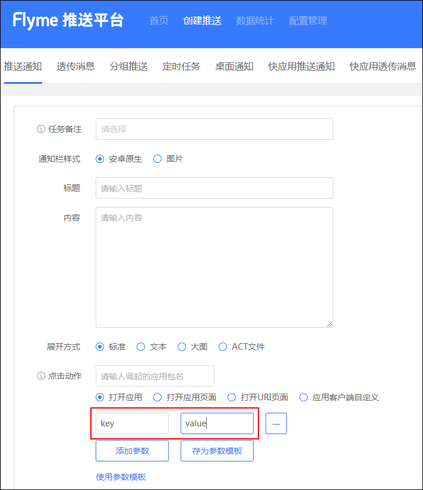

# PushSDK3 说明文档

[![Release][release-image]][releases]

## Android Studio AAR 发布说明
**NOTE:** ``` 重要通知如下```

* PushSDK不再区分魅族内部版与外部版本,所有的应用统一接入,目前PushSDK统一发布在[Jcenter](https://bintray.com/meizupush/PushSDK/PushSDK-Internal-Meizu),
  统一的配置修改为```compile 'com.meizu.flyme.internet:push-internal:3.5.0@aar'```, 先前的外部应用接入的artifactId```push-internal-publish```,还可以继续使用到版本```3.3.170329```,后期版本请尽快修改

* 魅族内部应用如果从[Artifactory PushSDK](http://artifactory.rnd.meizu.com/artifactory/)下载,如果此版本不存在,会自动从jcenter拉取,以后可能不再单独发布aar到魅族内部Artifactory,以Jcenter版本为主

* 魅族PushSDK SNAPSHOT版本发布在oss.jfrog.org中,流程请参考[Android开源库测试发布流程](https://comsince.github.io/2017/03/04/library-snapshot-publish/),验证通过后才会发布到jcenter
  如果想使用SNAPSHOT版本,可以在build.gradle repository增加如下配置:
```
      maven{
            url 'https://oss.jfrog.org/artifactory/oss-snapshot-local'
        }
```  


### [CentOS AndroidSDK 编译环境配置以及PushDemo编译说明](CentOS_Android_build.md)

# 更新日志
## [2019-07-01]V3.8.3
* 修复一些安全漏洞和若干BUG
* 优化内部推送逻辑

## [2018-08-30]V3.8.1
* 修复一些安全漏洞

## [2018-08-01]V3.7.4
* 优化非魅族手机订阅逻辑

## [2018-07-12]V3.7.3
* 优化一些小细节

## [2018-06-28]V3.7.1
* 修复zip文件目录遍历的漏洞
* [Android安全开发之ZIP文件目录遍历](https://jaq.alibaba.com/community/art/show?articleid=383)

## [2018-06-03]V3.7.0
* 修复部分第三方机型可能出现的兼容性报错问题

## [2018-05-03]V3.6.7
* 修复三方机型的兼容性问题

## [2018-02-08]V3.6.3
* 修改可能出现的空指针问题

## [2017-12-4]V3.6.0
* 启用代码proguard,减少包大小
* 去除获取地址位置权限声明

## [2017-12-01]V3.5.2
* 通知栏删除接口增加一次删除多个NotifyID的功能一次可传入多个notifyId

## [2017-11-13]```重要变更```V3.5.0
* 增加通知栏清除功能,通知栏消息聚合功能,[具体详见PushManager API](#push_manager_api)
* MzPushMessageReceiver 接口重大变更,[具体详见MzPushMessageReceiver回调修改说明](#mz_pushreceiver_callback)
* 优化数据上报逻辑,提升数据上报准确度
* 一些已知问题的修改

## [2017-08-18]V3.4.2
* 解决使用换机助手时,应用无法更新pushId
* 应用没有设置状态栏图标,默认设置flyme第三方风格的状态栏图标

**NOET:** 使用jar集成的建议接入此版本,建议最新版接入此版本

## [2017-06-01]V3.3.170601
*  1 增加应用拉活功能

## [2017-05-18]V3.3.170518
*  1 增加内存缓存数据上报策略,解决Sqlite数据库无法读取的错误

## [2017-04-26]V3.3.170505
*  1 优化PushManager逻辑
*  2 增加打开第三方应用的功能
*  3 统一PushSDK内外版本,artifactId为:```push-internal```,完整配置如下:```compile 'com.meizu.flyme.internet:push-internal:3.3.170505@aar'```
*  4 增加点击通知栏和透传消息传递平台参数的功能

## ~~[2017-03-29]V3.3.170329~~
*  1 外部应用设置状态栏图标也能正确显示
*  2 优化log输出逻辑,日志按天输出
*  3 修复intent.parseuri的安全漏洞,但是打开应用某个界面必须填写Activity的全路径
*  4 增加统一修改通知栏和透传消息开关的接口
*  5 增加取消所有标签接口
*  6 优化一些性能问题

## [2017-01-18]V3.3.170112
*  1 删除https无用代码
*  2 解决deviceId无法获取导致无法订阅的问题
*  3 删除无用权限声明

## [2017-01-10]V3.3.170110
*  1 解决Jar包集成无法找到R类的问题
*  2 解决数据上报安全性问题

## [2017-01-04]V3.3.170103
* 1 精简sdk代码,权限,不再依赖第三方库
* 2 加入通知栏动态视频功能，如需要使用，需要向平台申请开通权限

## [2016-12-26]V3.3.161226
* 1 Https 加入安全校验
* 2 通知栏功能仅支持 API 16以上的android版本
* 3 通知栏兼容至API 11

## [2016-12-23] V3.3.161222 
* 1 pushsdk 去除第三方依赖，不再依赖其他任何第三方库
* 2 jecter暂停使用，请下载[PushSDK aar](https://github.com/MEIZUPUSH/PushDemo/releases)本地引用,具体可以参考pushdemo的libs目录
  
# [快速接入魅族Push点击这里](QuickStart.md)  

# PushSDK接入详细说明目录<a name="index"/>
* [一.应用背景](#app_backgroud)
* [二.设计思想](#design_thought)
* [三.魅族云推送集成说明](#integrete_setting_description)
    * [准备工作](#prepare_setting)
    * [3.1 pushSDK引用配置说明](#pushsdk_internal)
    * [3.2 必要的配置](#nessary_setting)
        * [3.2.1 兼容flyme5以下版本推送兼容配置](#permission_adpter_flyme5_down)
        * [3.2.2 注册消息接收Receiver](#pushmessage_receiver_manifest_setting)
        * [3.2.3 实现自有的PushReceiver,实现消息接收，注册与反注册回调](#pushmessage_receiver_code_setting)   
        * [3.2.4 自定义通知栏小图标](#set_notification_builder)
* [四 通知栏消息扩展功能使用说明](#notification_description)
    * [4.1 原理概述](#notification_decribtion)
    * [4.2 打开URI](#open_web)
    * [4.3 客户端自定义](#selfDefineContentString)
* [五 兼容Flyme低版本推送](#adpter_flyme)
    * [5.1 兼容说明](#adpter_describe)
    * [5.2 增加权限声明配置](#flyme3_permesioin)
    * [5.3 增加PushReceiver Action声明](#flyme3_receiver_action)
    * [5.4 实现onMessage接收推送消息](#flyme3_onrecieve_message)
    * [5.5 消息处理流程](#flyme3_process_message)  
* [六 PushManager接口说明](#pushmanager_interface_describe)
    * [~~6.1 旧版Push注册接口~~](#register_description)
    * [~~6.2 旧版Push反注册接口~~](#unregister_description)
    * [6.3 订阅接口](#register)
    * [6.4 反订阅接口](#unregister)
    * [6.5 通知栏和透传消息开关状态转换](#pushmessage_switcher)
    * [6.6 检查通知栏和透传消息开关状态](#check_switcher)
    * [6.7 标签订阅](#subscribe_tags)
    * [6.8 取消标签订阅](#un_subscribe_tags)
    * [6.9 获取标签订阅列表](#chekc_subscribe_tags)
    * [6.10 别名订阅](#subscribe_alias)
    * [6.11 取消别名订阅](#un_subscribe_alias)
    * [6.12 获取别名](#check_subscribe_alias)
    * [6.13 获取pushId](#get_push_id)
    * [6.14 取消所有标签订阅](#un_subscribe_all_tags)
    * [6.15 同时打开或关闭通知栏和透传开关](#pushmessage_switcher_all)
    * [6.16 基于缓存重试机制的回调策略开关](#pushmessage_remote_invoker_switcher)
* [反馈与建议](#feedback)
* [问题汇总说明](#question_and_answer)

## 概述
如果你对pushSDK的实现原理感兴趣，请点击这里 [PushSDK第三方设计实践](http://comsince.github.io/push-design-thirdparty-doc) ，另外这个工程也提供的源码，有兴趣的同学可以star一下！

## 一 应用背景<a name="app_backgroud"/>

app为了及时获取到服务器端的消息更新，一般会采用轮寻或者推送的方式来获取消息更新，轮寻导致终端设备流量、电量、等系统资源严重浪费，所以目前采用的比较广泛的是推送的方式，目前 Meizu 的 Push SDK 不能脱离 Flyme OS 存在，当该 SDK 脱离 Flyme OS 之后由于没有长链接导致不能正常收到推送消息。本 SDK 首先要解决的时长链接由 SDK 自己维护，同时还要解决的就是多个 app 引用同一个 SDK 时长链接的复用问题。


## 二 设计思想<a name="design_thought"/>

该 SDK 以 Android Service 方式运行，独占一个进程，该 Service 自己维护与推送服务器的长链接。如果一款手机安装了多个集成了 SDK 的手机应用，则只有一个 service 实例运行，不会每个应用都会开启一个后台 service，而是采用多个应用共享一个Push通道的方式，这就解决了长链接复用的问题，节省了对流量、电量的浪费。使用该 SDK 只需要关心 PushManager 提供的API，与 MzPushMessageReceiver 提供的回调接口以及相应的配置即可。


## 三 魅族云推送集成说明<a name="integrete_setting_description"/>


### 准备工作<a name="prepare_setting"/>

PushSDK3.0以后的版本使用了最新的魅族插件发布aar包，因此大家可以直接引用aar包；对于一些通用的权限配置，工程混淆，应用可以不再配置了，现有你只需要在你的应用中配置相应的消息接收的receiver

### 3.1 pushSDK引用配置说明<a name="pushsdk_internal"/>

**NOTE:** 我们已经将pushsdk发布到jcenter,你只需如下配置即可

* 对内版本配置如下：

```
    dependencies {
        compile 'com.meizu.flyme.internet:push-internal:3.6.+@aar'
    }
    
```

**NOTE:** 加入@aar指定编译下载aar,不默认使用jar;如果你需要使用jar,请参考[Eclipse_PushDemo接入方式](https://comsince.github.io/2017/02/21/mzpushsdk-eclipse/)

**NOTE:** 如果由于各种原因不能使用jcenter依赖，还可以从以下链接下载sdk相关支持包

* 下载地址
  [~~push-sdk-github~~](https://github.com/MEIZUPUSH/PushDemo/releases)
  

### 3.2 必要的配置<a name="nessary_setting"/>

#### 3.2.1 兼容flyme5以下版本推送兼容配置<a name="permission_adpter_flyme5_down"/>

```
  <!-- 兼容flyme5.0以下版本，魅族内部集成pushSDK必填，不然无法收到消息-->
  <uses-permission android:name="com.meizu.flyme.push.permission.RECEIVE"></uses-permission>
  <permission android:name="包名.push.permission.MESSAGE" android:protectionLevel="signature"/>
  <uses-permission android:name="包名.push.permission.MESSAGE"></uses-permission>
    
  <!--  兼容flyme3.0配置权限-->
  <uses-permission android:name="com.meizu.c2dm.permission.RECEIVE" />
  <permission android:name="你的包名.permission.C2D_MESSAGE"
                    android:protectionLevel="signature"></permission>
  <uses-permission android:name="你的包名.permission.C2D_MESSAGE"/>

```

#### 3.2.2 注册消息接收Receiver<a name="pushmessage_receiver_manifest_setting"/>

```xml
  <!-- push应用定义消息receiver声明 -->
  <receiver android:name="包名.MyPushMsgReceiver">
      <intent-filter>
          <!-- 接收push消息 -->
          <action android:name="com.meizu.flyme.push.intent.MESSAGE" />
          <!-- 接收register消息 -->
          <action android:name="com.meizu.flyme.push.intent.REGISTER.FEEDBACK" />
          <!-- 接收unregister消息-->
          <action android:name="com.meizu.flyme.push.intent.UNREGISTER.FEEDBACK"/>
          <!-- 兼容低版本Flyme3推送服务配置 -->
          <action android:name="com.meizu.c2dm.intent.REGISTRATION" />
          <action android:name="com.meizu.c2dm.intent.RECEIVE" />
          <category android:name="包名"/>
      </intent-filter>
  </receiver>
```

**NOTE:** 包名填写你配置的的pushReceiver所在包名即可！

#### 3.2.3 实现自有的PushReceiver,实现消息接收，注册与反注册回调<a name="pushmessage_receiver_code_setting"/>

```
  public class MyPushMsgReceiver extends MzPushMessageReceiver {
    
    @Override
    @Deprecated
    public void onRegister(Context context, String pushid) {
        //调用PushManager.register(context）方法后，会在此回调注册状态
      //应用在接受返回的pushid
    }
    
    @Override
    public void onMessage(Context context, String s) {
      //接收服务器推送的透传消息
    }
    
    @Override
    @Deprecated
    public void onUnRegister(Context context, boolean b) {
      //调用PushManager.unRegister(context）方法后，会在此回调反注册状态
    }
    
    //设置通知栏小图标
    @Override
    public PushNotificationBuilder onUpdateNotificationBuilder(PushNotificationBuilder pushNotificationBuilder) {
        //重要,详情参考应用小图标自定设置
      pushNotificationBuilder.setmStatusbarIcon(R.drawable.mz_push_notification_small_icon);
    }
    
    @Override
    public void onPushStatus(Context context,PushSwitchStatus pushSwitchStatus) {
      //检查通知栏和透传消息开关状态回调
    }
    
    @Override
    public void onRegisterStatus(Context context,RegisterStatus registerStatus) {
        //调用新版订阅PushManager.register(context,appId,appKey)回调
    }
    
    @Override
    public void onUnRegisterStatus(Context context,UnRegisterStatus unRegisterStatus) {
        //新版反订阅回调
    }
    
    @Override
    public void onSubTagsStatus(Context context,SubTagsStatus subTagsStatus) {
      //标签回调
    }
    
    @Override
    public void onSubAliasStatus(Context context,SubAliasStatus subAliasStatus) {
        //别名回调
    }
    @Override
    public void onNotificationArrived(Context context, MzPushMessage mzPushMessage) {
       //通知栏消息到达回调，flyme6基于android6.0以上不再回调
    }
        
    @Override
    public void onNotificationClicked(Context context, MzPushMessage mzPushMessage) {
       //通知栏消息点击回调
    }
        
    @Override
    public void onNotificationDeleted(Context context, MzPushMessage mzPushMessage) {
       //通知栏消息删除回调；flyme6基于android6.0以上不再回调
    }    
   
 }
  
```


#### 3.2.4 自定义通知栏小图标<a name="set_notification_builder"/>

PushSDK加入了通知栏状态栏小图标自定义的功能，需要在配置的的pushReceiver中覆盖如下的方法：

```
    /**
     * 获取smallicon
     * */
    public void onUpdateNotificationBuilder(PushNotificationBuilder pushNotificationBuilder){
          //设置通知栏弹出的小图标
          pushNotificationBuilder.setmStatusbarIcon(R.drawable.mz_push_notification_small_icon);
    };
```

**Note:** Flyme6新的通知栏中心需要按照名称来获取状态栏Icon,你需要在相应的drawable不同分辨率文件夹下放置一个名称为```mz_push_notification_small_icon```的状态栏图标文件,请确保名称正确，否则将无法正确显示你应用的状态栏图标 


**Note:** 至此pushSDK 已经集成完毕，现在你需要在你的Application中调用新版的[register](#register)方法
```
  魅族推送只适用于Flyme系统,因此可以先行判断是否为魅族机型，再进行订阅，避免在其他机型上出现兼容性问题
  if(MzSystemUtils.isBrandMeizu(this)){
     PushManager.register(this, APP_ID, APP_KEY);
  }
```
并在你的Receiver中成功回调onRegisterStatus(RegisterStatus registerStatus)方法就可以了，
你现在可以到[新版Push平台](http://push.meizu.com) 找到你的应用推送消息就可以了.


以下内容是pushSDK提供的api汇总,具体功能详见[PushManager API](#pushmanager_interface_describe)具体说明,请根据需求选用合适的功能

#### **附表一:** PushManager接口说明汇总表:<a name="push_manager_api"/>

| 接口名称      | 接口说明| 使用建议|是否已经废弃|对应MzPushReceiver回调方法|
| :--------: | :--------:| :--: |:--: |:--: |
|~~register(Context context)~~|旧版订阅接口|请使用新版订阅接口|是|onRegister(Context context,String pushId)|
|~~unRegister(Context context)~~|旧版反订阅接口|请使用新版的反订阅接口|是|onUnRegister(Context context,boolean success)|
|register(Context context,String appId,String appKey)|新版订阅接口|建议Application onCreate调用|否|onRegisterStatus(Context context,RegisterStatus registerStatus)|
|unRegister(Context context,String appId,String appKey)|新版反订阅接口|取消所有推送时使用,慎用,如果取消,将有可能停止所有推送|否|onUnRegisterStatus(Context context,UnRegisterStatus unRegisterStatus)|
|subScribeTags(Context context,String appId,String appKey,String pushId,String tags)|订阅标签|无|否|onSubTagsStatus(Context context,SubTagsStatus subTagsStatus)|
|unSubScribeTags(Context context, String appId, String appKey, String pushId,String tags)|取消标签订阅|无|否|onSubTagsStatus(Context context,SubTagsStatus subTagsStatus)|
|unSubScribeAllTags(Context context, String appId, String appKey, String pushId)|取消所有标签订阅|无|否|onSubTagsStatus(Context context,SubTagsStatus subTagsStatus)|
|checkSubScribeTags(Context context,String appId,String appKey,String pushId)|获取标签列表|无|否|onSubTagsStatus(Context context,SubTagsStatus subTagsStatus)|
|subScribeAlias(Context context,String appId,String appKey,String pushId,String alias)|订阅别名|无|否|onSubAliasStatus(Context context,SubAliasStatus subAliasStatus)|
|unSubScribeAlias(Context context,String appId,String appKey,String pushId,String alias)|取消别名|无|否|onSubAliasStatus(Context context,SubAliasStatus subAliasStatus)|
|checkSubScribeAlias(Context context,String appId,String appKey,String pushId)|获取别名|无|否|onSubAliasStatus(Context context,SubAliasStatus subAliasStatus)|
|switchPush(Context context,String appId,String appKey,String pushId,boolean switcher)|通知栏和透传开关同时转换|如果需要同时关闭或打开通知栏和透传消息开关,可以调用此方法|否|onPushStatus(Context context,PushSwitchStatus pushSwitchStatus)|
|switchPush(Context context,String appId,String appKey,String pushId,int pushType,boolean switcher)|通知栏和透传消息开关单独转换|无|否|onPushStatus(Context context,PushSwitchStatus pushSwitchStatus)|
|checkPush(Context context,String appId,String appKey,String pushId)|检查当前开关状态|此方法在有无网络下都能成功返回|否|onPushStatus(Context context,PushSwitchStatus pushSwitchStatus)|
|clearNotification(Context context)|清除该应用弹出的所有应用的通知栏消息||否|无|
|clearNotification(Context context, int notifyId)|清除该应用弹出的指定notifyId的通知栏消息|notifyId在MzPushMessageReceiver中onNotificationArrived中回调|否|无|

#### **附表二:** MzPushReceiver抽象方法说明<a name="mz_pushreceiver_callback"/>

| 接口名称      | 接口说明| 使用建议|是否已经废弃|新接口|
| :--------: | :--------:| :--: |:--: |:--:|
|~~onRegister(Context context,String pushId)~~|旧版pushid回调接口|建议不再使用|是||
|~~onUnRegister(Context context,boolean success)~~|旧版反订阅回调接口|建议不再使用|是||
|onMessage(Context context,String message)|透传消息回调|请选择一个实现即可|否||
|onMessage(Context context,String message,String platformExtra)| 透传消息回调|跟上面方法两者选其一实现,不要两个方法同时覆盖,否则一次透传消息会回调两次,此方法多一个平台参数,格式如下格式如下:```{"task_id":"1232"}```|否||                                                                                  
|onMessage(Context context,Intent intent)|处理flyme3.0平台的推送消息|flyme3.0平台支持透传消息,只有本方法才能处理flyme3的透传消息,具体相见flyme3获取消息的方法|否||
|~~onNotificationClicked(Context context, String title, String content, String selfDefineContentString)~~|通知栏点击回调|无|否|onNotificationClicked(Context context, MzPushMessage mzPushMessage)|
|~~onNotificationArrived(Context context, String title, String content, String selfDefineContentString)~~|通知栏展示回调|Flyme6|新版本恢复此功能,此方法只在应用进程存在时才可回调|onNotificationArrived(Context context, MzPushMessage mzPushMessage)|
|~~onNotificationDeleted(Context context, String title, String content, String selfDefineContentString)~~|通知栏删除回调|Flyme6基于android6.0不再回调|否|onNotificationDeleted(Context context, MzPushMessage mzPushMessage)|
|onUpdateNotificationBuilder(PushNotificationBuilder pushNotificationBuilder)|通知栏图标设置|无|否||
|onPushStatus(Context context,PushSwitchStatus pushSwitchStatus)|Push开关状态回调|无|否||
|onRegisterStatus(Context context,RegisterStatus registerStatus)|订阅状态回调|无|否||
|onUnRegisterStatus(Context context,UnRegisterStatus unRegisterStatus)|反订阅回调|无|否||
|onSubTagsStatus(Context context,SubTagsStatus subTagsStatus)|标签状态回调|无|否||
|onSubAliasStatus(Context context,SubAliasStatus subAliasStatus)|别名状态回调|无|否||

                 

## 四 通知栏消息扩展功能使用说明<a name="notification_description"/>

### 4.1 原理概述<a name="notification_decribtion"/>

* 打开应用组件的方式

目前打开应用组件的方式都是通过构建Intent的方式,利用`startActivity`方法调起应用要打开的组件,如下代码

```
        //buildIntent方法在此省略,具体详见：com.meizu.cloud.pushsdk.handler.impl.notification.NotificationClickMessageHandler
        Intent privateIntent = buildIntent(context(), message);
        if(privateIntent != null){
            privateIntent.addFlags(Intent.FLAG_ACTIVITY_NEW_TASK);
            try {
                context().startActivity(privateIntent);
            } catch (Exception e){
                DebugLogger.e(TAG,"Click message StartActivity error "+e.getMessage());
            }
        }
```

* 参数传递

平台填写参数值如下图所示:



将一律通过`intent.putString("key","value")`的方式填充参数与值

* 参数获取

当跳转到目前activity时,可以通过如下方式获取在平台填写的参数值

```
String value = getIntent().getStringExtra("key")
```

**NOTE:** 点击通知栏的时候,除了传递用户自定义的参数,还可以获取平台taskid等参数,此参数为sdk传递的默认参数,不需在平台配置,如果需要taskId相关参数可以通过如下方式获取:

 ```
 String platfromExtra = getIntent().getStringExtra("platform_extra");
 ```
这个参数的格式如下:
```
  {"task_id":"1234564545"}
```


* 页面名称<a name="activity_name"/>

Push平台中activity页面名称实际为：应用要打开的Activity名称,即是相对应用的包名的Activity名称，如下一段配置

```
<manifest xmlns:android="http://schemas.android.com/apk/res/android"
    package="com.meizu.pushdemo">
    <application
        android:allowBackup="true"
        android:icon="@drawable/ic_launcher"
        android:label="@string/app_name"
        android:theme="@style/AppTheme" >
        <activity android:name=".TestAcitivity">
        </activity>
    </application>
 </manifest>
```

**Note:** 填写必须是activity全包名路径,如上activity配置必须为：（com.meizu.pushdemo.TestActivity）


### 4.2 打开URI<a name="open_web"/>

当你push平台选取了打开网页这个选项，并配置的URL地址，当pushSDK收到消息后就会弹出通知栏，当你点击后会跳转到默认设置的组件处理当前的URI

### 4.3 客户端自定义<a name="selfDefineContentString"/>

自定义的内容将会在用户点击的时候通过如下`MzPushReceiver`的回调方法原样传递,自定义参数值即为`selfDefineContentString`

```
    @Override
    public void onNotificationClicked(Context context, String title, String content, String selfDefineContentString) {
        //处理点击事件,用户自定义参数为selfDefineContentString
        DebugLogger.i(TAG, "onNotificationClicked title " + title + "content " + content + " selfDefineContentString " + selfDefineContentString);
    }
```


## 五 兼容Flyme低版本推送<a name="adpter_flyme"/>

### 5.1 兼容说明<a name="adpter_describe"/>
云服务经历几次大的变更，从之前的C2DM，到现在可以完全脱离Flyme平台作为一种完全开放给第三方应用的SDK，在这个阶段出现多种集成方式，给以后的应用集成带来极大的困扰，魅族PushSDK极力在减少Flyme版本迭代给应用集成带来的麻烦，但应用还是需要做细小的更改才能做到与低版本Flyme的兼容。

### 5.2 增加权限声明配置<a name="flyme3_permesioin"/>

```
 <uses-permission android:name="com.meizu.c2dm.permission.RECEIVE" />
 <permission android:name="你的应用包名.permission.C2D_MESSAGE"
             android:protectionLevel="signature"></permission>
 <uses-permission android:name="你的应用包名.permission.C2D_MESSAGE"/>
```

### 5.3 增加PushReceiver Action声明<a name="flyme3_receiver_action"/>

```
  <action android:name="com.meizu.c2dm.intent.REGISTRATION" />
  <action android:name="com.meizu.c2dm.intent.RECEIVE" />
```

一个完整的兼容Flyme3.0 推送的Receiver配置如下:

```
<!-- push应用定义消息receiver声明 -->
<receiver android:name="your.package.PushMsgReceiver">
     <intent-filter>
     <!-- 接收push消息 -->
     <action android:name="com.meizu.flyme.push.intent.MESSAGE" />
     <!-- 接收register消息-->
     <action android:name="com.meizu.flyme.push.intent.REGISTER.FEEDBACK"/>
     <!-- 接收unregister消息-->
     <action android:name="com.meizu.flyme.push.intent.UNREGISTER.FEEDBACK"/>
     <!-- 兼容低版本Flyme推送服务配置 -->
     <action android:name="com.meizu.c2dm.intent.REGISTRATION" />
     <action android:name="com.meizu.c2dm.intent.RECEIVE" />
     <category android:name="你的应用包名"></category>
     </intent-filter>
 </receiver>
```

### 5.4 实现onMessage接收推送消息<a name="flyme3_onrecieve_message"/>

PushMessageReceiver覆盖onMessage(Context context,Intent intent)方法接收Flyme3.0平台push消息

详情参见下面的方法的说明:

```
 /**
   * 收到推送消息的回调,Flyme4.0以上版本,或者云服务5.0以上版本 通过此方法接收Push消息
   * @param context
   *            context
   * @param message
   *            收到的推送消息
   * */
   public abstract void onMessage(Context context,String message);

   /**
   * 处理flyme3.0等以下平台的推送消息
   * @param context
   * @param intent
   *           flyme3.0平台上默认是将透传的消息json,按照key-value的组合设置到intent中,如果要获取相应的数据,可以调用intent.getExtra(key)方法获取
   * */
   public void onMessage(Context context,Intent intent){}
```

### 5.5 消息处理流程<a name="flyme3_process_message"/>
注意这里的onMessage方法参数不一样,应用接收到消息后，需要自己从Intent中自行获取推送的消息,完整的流程如下

* (1) 调用Push接口发送消息时,消息体为一个正确Json字符串，例如：

```
{
       "content": "今日头像下载app狂送100元",
       "title": "今日头条重大利好",
       "isDiscard": true,
       "clickType": "1"
 }
```

* (2) 处理推送消息

   例如应用需要获取content字段的内容,可以通过intent获取相应的内容，完成代码如下

```
    @Override
    public void onMessage(Context context, Intent intent) {
       String content = intent.getStringExtra("content");
       Log.i(TAG,"flyme3 onMessage "+content);
    }
```


## 六 PushManager接口说明<a name="pushmanager_interface_describe"/>

### 6.1 ~~旧版订阅接口~~<a name="register_description"/>

```
  /**
    * 订阅接口
    */
  public static void register(Context context);
```

**NOTE:** 此接口已经废弃建议使用新版的订阅接口

* 说明：原则上应用调用register方法表示与服务器建立推送关系，这是可以通过push平台向该应用推送消息了，所以应用至少要调用过一次register方法,应用为了防止多次重复注册，可以先判断一下是否获取成功过pushid，具体实现代码如下：

```java
    if(PushManager.getPushId(context) == null){
      PushManager.register(Context context)
    }

```

**Note:**
   * (1)如果应用需要取消订阅,调用如下方法 PushManager.unRegister(Context context)
   * (2)应用如果成功获取到pushId,可以调用一下方法获取本应用的pushId PushManager.getPushId(Context context)

### 6.2 ~~旧版反订阅接口~~<a name="unregister_description"/>

**NOTE:** 此接口已经废弃

```
  /**
    * 反订阅
    * */
  public static void unRegister(Context context);
```

**NOTE:** 以下为新版的接口,所有的接口对应的回调都你的配置的PushReceiver中

### 6.3 订阅接口<a name="register"/>

* 接口说明

```
   /**
     * @param context
     * @param appId
     *         push 平台申请的应用id
     * @param appKey
     *         push 平台申请的应用key
     * 使用说明：可在应用启动时调用此方法，例如在Application.onCreate()调用即可,魅族推送只适用于Flyme系统,因此可以先行判断是否为魅族机型，再进行订阅，避免在其他机型上出现兼容性问题
     * if(MzSystemUtils.isBrandMeizu(this)){
          PushManager.register(this, APP_ID, APP_KEY);
       }
     * */
     public static void register(Context context,String appId,String appKey);
```

* 对应Receiver中的回调方法

```
    @Override
    public void onRegisterStatus(Context context,RegisterStatus registerStatus) {
        
    }
```

### 6.4 反订阅接口<a name="unregister"/>

* 接口说明

```
   /**
     * @param context
     * @param appId
     *         push 平台申请的应用id
     * @param appKey
     *         push 平台申请的应用key
     * 使用说明：如果你不想接收任何推送，可以取消订阅关系，此时你将无法收到透传消息和通知栏消息
     * */
     public static void unRegister(Context context,String appId,String appKey);
```

* 对应Receiver中的回调方法

```
    @Override
    public void onUnRegisterStatus(Context context,UnRegisterStatus unRegisterStatus) {
        
    }
```

### 6.5 通知栏和透传消息开关状态转换<a name="pushmessage_switcher"/>

* 接口说明

```
   /**
     * @param appId
     *        push 平台申请的应用id
     * @param appKey
     *        push 平台申请的应用key
     * @param pushId
     *        注册成功后返回的pushid
     * @param pushType
     *        接收的消息类型，0:通知栏消息 1: 透传消息
     * @param switcher
     *        修改push类型开关状态
     * 使用说明：此方法最好只有在用户需要打开或关闭消息时调用，不要频繁调用；当你第一次register成功后，通知栏消息和透传消息已经默认打开
     * */
    public static void switchPush(Context context,String appId,String appKey,String pushId,int pushType,boolean switcher);
```

* 对应Receiver中的回调方法

```
    @Override
    public void onPushStatus(Context context,PushSwitchStatus pushSwitchStatus) {
        
    }
```

### 6.6 检查通知栏和透传消息开关状态<a name="check_switcher"/>

* 接口说明

```
   /**
     * 检查通知栏和透传消息开关状态
     * @param appId
     *          push 平台申请的应用id
     * @param appKey
     *          push 平台申请的应用key
     * @param pushId
     *          注册成功后返回的pushid
     *
     *  结果会在你所实现的receiver的onCheckPush中返回
     * */
    public static void checkPush(Context context,String appId,String appKey,String pushId);
```

* 对应Receiver中的回调方法

```
    @Override
    public void onPushStatus(Context context,PushSwitchStatus pushSwitchStatus) {
        
    }
```

### 6.7 标签订阅<a name="subscribe_tags"/>

* 接口说明

```
   /**
     * 标签订阅
     * @param context
     * @param appId
     *         push 平台申请的应用id
     * @param appKey
     *         push 平台申请的应用key
     * @param tags
     *         多个标签逗号隔离
     * */
     public static void subScribeTags(Context context,String appId,String appKey,String pushId,String tags);
```

* 对应Receiver中的回调方法

```
      @Override
      public void onSubTagsStatus(Context context,SubTagsStatus subTagsStatus) {
        Log.i(TAG, "onSubTagsStatus " + subTagsStatus);
        //标签回调
      }
```

### 6.8 取消标签订阅<a name="un_subscribe_tags"/>

* 接口说明

```
    /**
      * 取消标签订阅
      * @param context
      * @param appId
      *         push 平台申请的应用id
      * @param appKey
      *         push 平台申请的应用key
      * @param tags
      *         多个标签逗号隔离
      * */
     public static void unSubScribeTags(Context context, String appId, String appKey, String pushId,String tags);
```

* 对应Receiver中的回调方法

```
      @Override
      public void onSubTagsStatus(Context context,SubTagsStatus subTagsStatus) {
        Log.i(TAG, "onSubTagsStatus " + subTagsStatus);
        //标签回调
      }
```

### 6.9 获取标签订阅列表<a name="chekc_subscribe_tags"/>

* 接口说明

```
   /**
     * 获取标签订阅列表
     * @param context
     * @param appId
     *         push 平台申请的应用id
     * @param appKey
     *         push 平台申请的应用key
     * */
     public static void checkSubScribeTags(Context context,String appId,String appKey,String pushId);
```

* 对应Receiver中的回调方法

```
      @Override
      public void onSubTagsStatus(Context context,SubTagsStatus subTagsStatus) {
        Log.i(TAG, "onSubTagsStatus " + subTagsStatus);
        //标签回调
      }
```

### 6.10 别名订阅<a name="subscribe_alias"/>

* 接口说明

```
   /**
     * 别名订阅
     * @param context
     * @param appId
     *         push 平台申请的应用id
     * @param appKey
     *         push 平台申请的应用key
     * @param pushId
     *         注册成功后返回的pushid
     * @param alias
     *         别名
     * */
     public static void subScribeAlias(Context context,String appId,String appKey,String pushId,String alias);
```

* 对应Receiver中的回调方法

```
    @Override
    public void onSubAliasStatus(Context context,SubAliasStatus subAliasStatus) {
        Log.i(TAG, "onSubAliasStatus " + subAliasStatus);
    }
```

### 6.11 取消别名订阅<a name="un_subscribe_alias"/>

* 接口说明

```
   /**
     * 取消别名订阅
     * @param context
     * @param appId
     *         push 平台申请的应用id
     * @param appKey
     *         push 平台申请的应用key
     * @param pushId
     *         注册成功后返回的pushid
     * @param alias
     *         别名
     * */
     public static void unSubScribeAlias(Context context,String appId,String appKey,String pushId,String alias);
```

* 对应Receiver中的回调方法

```
    @Override
    public void onSubAliasStatus(Context context,SubAliasStatus subAliasStatus) {
        Log.i(TAG, "onSubAliasStatus " + subAliasStatus);
    }
```

### 6.12 获取别名<a name="check_subscribe_alias"/>

* 接口说明

```
   /**
     * 获取别名
     * @param context
     * @param appId
     *         push 平台申请的应用id
     * @param appKey
     *         push 平台申请的应用key
     * @param pushId
     *         注册成功后返回的pushid
     * */
     public static void checkSubScribeAlias(Context context,String appId,String appKey,String pushId)
```

* 对应Receiver中的回调方法

```
    @Override
    public void onSubAliasStatus(Context context,SubAliasStatus subAliasStatus) {
        Log.i(TAG, "onSubAliasStatus " + subAliasStatus);
    }
```

### 6.13 获取pushId<a name="get_push_id"/>

* 接口说明

```
   /**
     * 根据应用包名获取pushId
     * @param context
     * @return 如果该包名没有注册，则默认返回为null
     * */
    public static String getPushId(Context context);
```


### 6.14 取消所有标签订阅<a name="un_subscribe_all_tags"/>

* 接口说明

```
    /**
          * 取消所有标签订阅
          * @param context
          * @param appId
          *         push 平台申请的应用id
          * @param appKey
          *         push 平台申请的应用key
          * */
        public static void unSubScribeAllTags(Context context, String appId, String appKey, String pushId)
```

* 对应Receiver中的回调方法

```
      @Override
      public void onSubTagsStatus(Context context,SubTagsStatus subTagsStatus) {
        Log.i(TAG, "onSubTagsStatus " + subTagsStatus);
        //标签回调
      }
```


### 6.15 同时打开或关闭通知栏和透传开关<a name="pushmessage_switcher_all"/>

```
    /**
         * 此接口提供通知栏和透传统一开或者统一关
         * @param appId
         *        push 平台申请的应用id
         * @param appKey
         *        push 平台申请的应用key
         * @param pushId
         *        注册成功后返回的pushid
         * @param switcher
         *        修改push开关状态,包括通知栏和透传两个开关,状态只能统一修改
         * */
        public static void switchPush(Context context,String appId,String appKey,String pushId,boolean switcher)
```

* 对应Receiver中的回调方法

```
    @Override
    public void onPushStatus(Context context,PushSwitchStatus pushSwitchStatus) {
        
    }
```
        
### 6.16 基于缓存重试机制的回调策略开关<a name= "pushmessage_remote_invoker_switcher"/>

```
   /**
     * 基于缓存重试机制的回调策略,此策略默认关闭
     *
     * 是否启用远程调用的方式,此方式需要flyme内置应用推送服务支持
     * 此方法原理在于,用户发出的请求不在本应用中调用,而是将请求包装发给推送服务的PushManagerService,此服务能够在断网情况下缓存
     * 应用的请求,等到用户手机联网,再重新将请求同步到服务端
     *
     * 如果启动此策略,非联网情况下不会立即回调给应用,需要在有网情况下,与服务端交互成功后,才将结果返回给应用
     * 此返回不保证一定能返回给应用,此种方式采用广播的方式发送给应用,如果应用此时不是常驻进程,应用可能会无法收到消息
     *
     * @param flag  是否启动远程缓存调用
     * */
     public static void enableCacheRequest(Context context,boolean flag);
```


### 反馈与建议<a name= "feed_back"/>

请在github上提交[issue](https://github.com/MEIZUPUSH/PushDemo/issues)反馈问题，我们会及时处理;提问前请查看之前的issue，不要重复提问。

### 问题汇总说明<a name= "question_and_answer"/>
*  1.Push服务收到推送消息，但是应用不弹出通知栏
   应用如果正确接入PushSDK，且能收到pushID表明Push服务与应用连接正常，有可能是应用没有配置混淆，导致MzPushSDK被混淆，无法正确解析消息所致

#### 一. 配置类问题

* 现象
```
    android.content.ActivityNotFoundException: Unable to find explicit activity class
    {com.meizu.mzbbs/com.meizu.mzbbs.ui.DetailsActivity }; 
    have you declared this activity in your AndroidManifest.xml?
``` 

* 原因
平台配置出现空格等特殊字符
activity配置出错

#### 二. 网络问题
* 现象
接收不到推送
* 解决方案
请先确认你所连接的网络是外网还是内网，你可以清除云服务的数据，重新发起注册

#### 三 魅族手机未发布问题
* 现象
注册成功，收不到推送
* 原因分析
未发布的手机由于Brand字段不为meizu，导致注册的时候push任务手机为第三方手机，其采用的就是imei_sn的方式注册，返回的pushID即为imei_sn_appID

* 解决方案
等待发布Brand更改为魅族，或者直接使用imei_sn的推送方式

#### 四 日志分析
* 日志地址
```
/sdcard/Android/data/pushSdk
```

#### 五 aar引用问题
* 出现aar最新包不生效，删除gradle cache即可
```
    删除volley-gslb兼容包aar本地缓存，其他请求可自行选择目录删除
    rm -rf ~/.gradle/caches/modules-2/files-2.1/com.meizu.gslb.volley
```

#### 六 push服务收到推送但是应用无法收到消息
* 现象
  在熄屏状态下应用无法收到通知栏消息，亮屏时能收到通知栏消息,最新的flyme固件不会出现该问题
* 原因
  系统问题，熄屏状态下发起服务调用，应用无响应,最新的flyme固件不会出现该问题
  
### 七 阿里APK加固可能会出现序列化问题 
 
### 八 资源文件不能混淆的问题
* andriod 5.0及以下flyme版本,apk混淆资源文件，导致通知栏不能正常弹出 

### 九 重复定义PushReceiver问题
* 不要在你的应用中实现多个pushreceiver,这只会回调其中一个receiver,否则会给你接入造成困扰 
 
  

 [release-image]: http://img.shields.io/badge/release-3.8.1-blue.svg?style=flat
 [releases]: https://bintray.com/meizupush/PushSDK/PushSDK-Internal-Meizu
